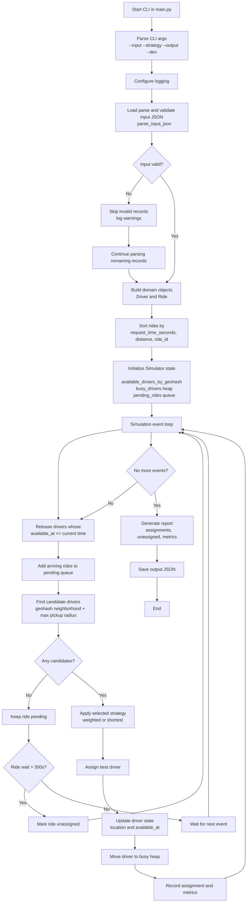

# System Flowchart

This diagram shows the end-to-end execution flow of the ride-share simulator.

```mermaid
flowchart TD
    A[Start CLI in main.py] --> B[Parse CLI args
    --input --strategy --output --dev]
    B --> C[Configure logging]
    C --> D[Load parse and validate input JSON
    parse_input_json]

    D --> E{Input valid?}
    E -- No --> F[Skip invalid records
    log warnings]
    F --> G[Continue parsing remaining records]
    G --> H[Build domain objects
    Driver and Ride]
    E -- Yes --> H

    H --> I[Sort rides by
    request_time_seconds, distance, ride_id]
    I --> J[Initialize Simulator state
    available_drivers_by_geohash
    busy_drivers heap
    pending_rides queue]

    J --> K[Simulation event loop]

    K --> L[Release drivers whose
    available_at <= current time]
    L --> M[Add arriving rides to pending queue]
    M --> N[Find candidate drivers
    geohash neighborhood + max pickup radius]

    N --> O{Any candidates?}
    O -- No --> P[Keep ride pending]
    P --> Q{Ride wait > 300s?}
    Q -- Yes --> R[Mark ride unassigned]
    Q -- No --> S[Wait for next event]
    S --> K

    O -- Yes --> T[Apply selected strategy
    weighted or shortest]
    T --> U[Assign best driver]
    U --> V[Update driver state
    location and available_at]
    V --> W[Move driver to busy heap]
    W --> X[Record assignment and metrics]
    X --> K

    R --> K

    K --> Y{No more events?}
    Y -- No --> L
    Y -- Yes --> Z[Generate report
    assignments, unassigned, metrics]
    Z --> AA[Save output JSON]
    AA --> AB[End]
```
